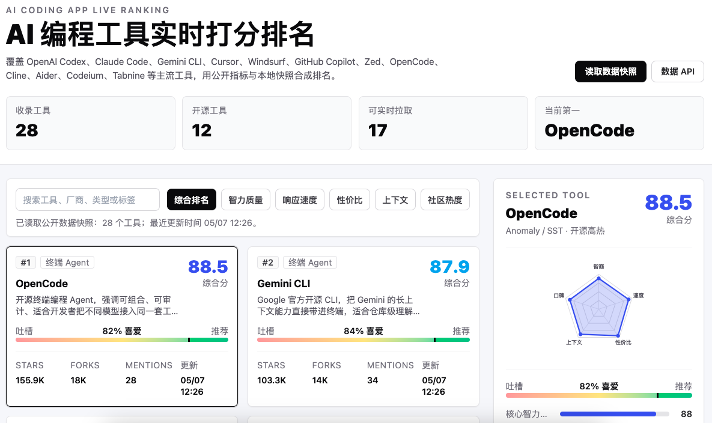

# Vibe Coding Top 20

> 一个更直观、更好看、更适合中文用户阅读的 **AI 编程工具排行榜项目**。  
> 把主流 AI Coding Agent、AI IDE、代码助手放进同一张实时看板里，看谁更强、谁更火、谁更值得用。

## Live Demo

- **在线演示：** `https://jeffreylexxx.github.io/vibe-coding-top20/`
- **项目仓库：** `https://github.com/jeffreylexxx/vibe-coding-top20`

> 上传到 GitHub Pages 后，把上面两个占位链接替换成你的真实地址即可。

---

## 项目截图

> 建议你后面补一张截图文件，例如：`docs/preview.png` 或 `assets/preview.png`



> 如果你暂时还没放截图，这里在 GitHub 上会显示为一个失效图片占位；等你补上截图后，仓库首页观感会立刻好很多。

---

## 这是什么？

**Vibe Coding Top 20** 是一个面向 GitHub 展示的可视化项目页面，用来追踪和对比当前主流的 AI 编程工具生态。

它不是一张死板的表格，而是一个更像“产品情报看板”的网页项目：

- 有排名
- 有多维评分
- 有社区热度
- 有 GitHub 数据
- 有雷达图
- 有实时刷新能力

如果你想快速知道：

- ChatGPT / Claude / Gemini / Cursor / Copilot / Windsurf / Cline / Aider / Zed 这些工具谁更强？
- 谁更适合真实写代码？
- 谁的社区热度正在上涨？
- 哪些项目在 GitHub 上最活跃？

这个项目就是干这个的。

---

## 这个项目有什么价值？

市面上的 AI 编程工具越来越多，但大多数比较内容都有几个问题：

- 太散，信息分布在不同网站
- 太主观，全靠个人体验
- 太过时，榜单一做完就老了
- 太无聊，只是一堆文字和表格

**Vibe Coding Top 20** 想做的是另一种体验：

### 1. 把分散信息收拢成一个页面
不用来回翻十几个官网和帖子，打开一个页面就能快速看全局。

### 2. 用更像“产品看板”的方式展示 AI 工具生态
不是纯静态介绍，而是尽量做成“活的排行榜”。

### 3. 同时兼顾颜值和信息密度
既适合第一次点进来的人快速理解，也适合想认真比较工具的人深入看细节。

### 4. 面向中文用户表达
很多同类页面偏英文、偏开发者内部语境；这个项目更强调中文可读性和信息直觉。

---

## 你会看到什么？

项目页面会展示类似这些内容：

- **AI 编程工具综合排名**
- **多维评分体系**
  - 智力质量
  - 响应速度
  - 性价比
  - 上下文能力
  - 社区口碑
- **实时 / 半实时公开数据**
  - GitHub stars
  - forks
  - issues
  - 社区讨论热度
- **单个工具详情卡片**
- **雷达图对比**
- **刷新机制与数据来源说明**

这让它更像一个：

> **“AI 编程工具生态情报面板”**

而不只是一个普通网页。

---

## 适合谁？

这个项目适合：

- 想挑选 AI 编程工具的开发者
- 想研究 AI IDE / Agent 赛道的人
- 做产品调研、竞品分析的人
- 想快速理解当前 AI Coding 工具格局的人
- 想做技术内容展示、可视化排名页的人

---

## 技术栈

项目使用：

- **React 18**
- **Vite**
- **Tailwind CSS**
- **Node.js 数据更新脚本**
- **GitHub Pages** 部署

---

## 本地运行

安装依赖：

```bash
npm install
```

启动开发环境：

```bash
npm run dev
```

构建生产版本：

```bash
npm run build
```

本地预览：

```bash
npm run preview
```

更新公开数据快照：

```bash
npm run update:data
```

---

## 项目结构

```bash
vibe-coding-top20/
├─ src/
│  ├─ App.jsx
│  ├─ main.jsx
│  ├─ index.css
│  ├─ data/
│  └─ utils/
├─ scripts/
│  └─ update-data.js
├─ docs/
├─ index.html
├─ package.json
├─ vite.config.js
└─ tailwind.config.js
```

---

## 这个项目不是在做什么？

它不是“官方认证排名”。

也不是绝对客观、永远准确的 AI 工具评测结论。

它更像是：

- **公开数据 + 本地评分模型 + 产品化展示**

所以它更适合：

- 看趋势
- 做横向比较
- 快速建立认知
- 帮你节省信息整理时间

而不是替代你自己的真实使用判断。

---

## 为什么这个项目会有意思？

因为 AI 编程工具的变化太快了。

今天大家讨论 Cursor，明天可能是 Claude Code，后天可能又被新的 Agent 工具抢走注意力。

很多内容还没写完就已经过时。

所以与其做一篇很快过期的文章，不如做一个可以持续更新、持续演化、持续比较的页面。

这就是这个项目最有意思的地方：

> **它不是一篇“关于 AI 编程工具的文章”，而是一个会持续长大的页面。**

---

## 未来方向

后续可以继续加入：

- 更多工具
- 时间趋势图
- 历史排名变化
- 筛选与对比模式
- 自动更新数据
- GitHub Actions 定时刷新
- 更强的中文说明与视觉表现

---

## 免责声明

本项目用于公开信息整理、可视化展示与产品观察。  
数据可能受 API 限流、社区讨论噪声、公开资料缺失和启发式评分模型影响，因此不构成投资、采购或商业决策建议。

---

## License

如果你计划正式开源，建议补充一个 LICENSE 文件（例如 MIT）。
